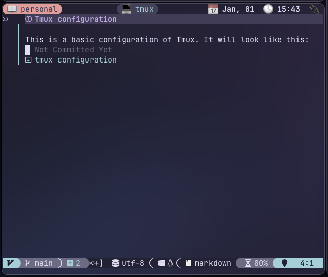

# Tmux configuration

This is a basic configuration of Tmux. It will look like this:



It also has a project selector, like this:


In order to make the selector work, add this to your `~/.zshrc` file:

```bash
export TMUX_PROJECTS_BASE_PATH="${HOME}/work:${HOME}/personal"
```

This will search for projects inside those two folders and will separate them by `workspace`
where the first folder after (i.e.) `work` will be the workspace and the next the project.
